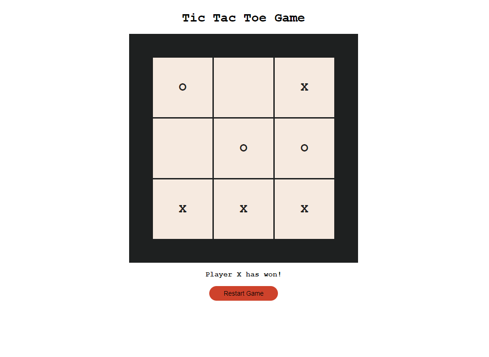

# Tic Tac Toe

Tic Tac Toe game that was created with HTML/CSS and JavaScript

### Play Tic Tac Toe [here](https://kimdaby.github.io/Tic-Tac-Toe/)

## Summary

The Tic Tac Toe app, crafted using HTML, CSS, and JavaScript, offers a captivating gaming experience. Leveraging 2D arrays for board management, it ensures efficient tracking of player moves. With CSS Flexbox and Grids, the interface achieves a visually appealing layout, enhancing user engagement. Players engage in strategic battles, placing their marks tactically on the grid. The app seamlessly captures wins, losses, and draws, providing an immersive gaming environment. Its intuitive design and responsive functionality make it accessible across various devices. Whether played solo or against a friend, the Tic Tac Toe app promises endless entertainment while showcasing the power of web technologies.

## Author

David (Yun) Kim
